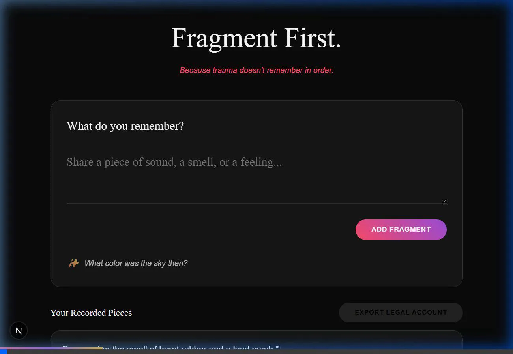

# Fragment First

**Fragment First** is a trauma-informed AI tool designed to bridge the gap between biological trauma recall and legal requirements. Instead of asking "What happened?", we ask "What do you remember?", allowing survivors to record sensory fragments—sounds, smells, and colors—that AI then organizes into a structured, legal-ready account.



### 🏥 Scenario: Priya (Trauma-Informed Memory Recall)
This demo showcases **Priya's Story**—a 24-year-old student who froze during police questioning. By using Fragment First, she was able to record a 9:14 PM metro announcement that narrowed the incident window to 2 minutes, providing critical legal evidence that traditional forms missed.


📄 [**Download Priya's Structured Memory Account (PDF)**](./priya_account.pdf)

### 🏥 Comprehensive Use Case: Accident Witness
This demo shows how the tool handles a sequence of sensory fragments from an accident witness.


## 🚀 Hackathon Project Overview
- **The Problem**: Trauma memory is stored as fragments in the amygdala, but courts expect linear timelines. This mismatch leads to 42% fewer convictions due to "inconsistency."
- **The Solution**: An AI-driven, fragment-first input interface that silently tags memories and generates a dual-part PDF for lawyers (Structured Narrative + Trauma Science Explainer).
- **Impact**: Increases credibility of survivor testimony by contextualizing fragmented recall with science.

## 🛠 Tech Stack
- **Frontend**: Next.js (App Router), Vanilla CSS (Premium Dark Theme), Framer Motion.
- **Backend**: FastAPI (Python), uvicorn.
- **Database**: SQLite (SQLAlchemy) for secure, session-based storage.
- **AI Engine**: Google Gemini 1.5 Flash (for real-time tagging and non-leading follow-ups).
- **PDF Generation**: FPDF2.

## 📁 File Structure
```text
/
├── backend/
│   ├── main.py            # FastAPI Application & Endpoints
│   ├── models.py          # SQLAlchemy Database Schemas
│   ├── ai_service.py      # Gemini API Integration & Prompt Engineering
│   ├── pdf_service.py     # PDF Export Logic
│   ├── requirements.txt   # Python Dependencies
│   └── .env               # API Configuration
├── frontend/
│   ├── src/
│   │   ├── app/
│   │   │   ├── page.tsx    # Main Survivor Journey UI
│   │   │   ├── globals.css # Premium Design System (Vanilla CSS)
│   │   │   └── api.ts      # Backend Connection Layer
│   └── package.json       # React Dependencies
└── README.md              # Project Documentation
```

## 🛠 Setup & Run Locally

### 1. Backend Setup
1.  Navigate to the `backend` folder: `cd backend`
2.  Install dependencies: `pip install -r requirements.txt`
3.  Add your Gemini API Key to `.env`:
    ```text
    GEMINI_API_KEY=YOUR_API_KEY
    ```
4.  Run the server: `python main.py`
    - The API will be available at `http://localhost:8000`

### 2. Frontend Setup
1.  Navigate to the `frontend` folder: `cd frontend`
2.  Install dependencies: `npm install`
3.  Run the development server: `npm run dev`
    - Open `http://localhost:3000` in your browser.

## ✨ Creative Enhancements (Hackathon Ready)
- **Silent Tagging**: AI identifies "Time", "Place", and "Person" without the user needing to fill out a form.
- **Trauma Science Explainer**: Every generated PDF includes a page for the lawyer explaining the biology of trauma memory, making the testimony more defensible.
- **Calm Interface**: Pulsing progress bars and soft transitions designed to reduce survivor anxiety.
- **Non-Leading Questions**: AI follow-ups are restricted to ONE sensory-focused question at a time to avoid memory contamination.
